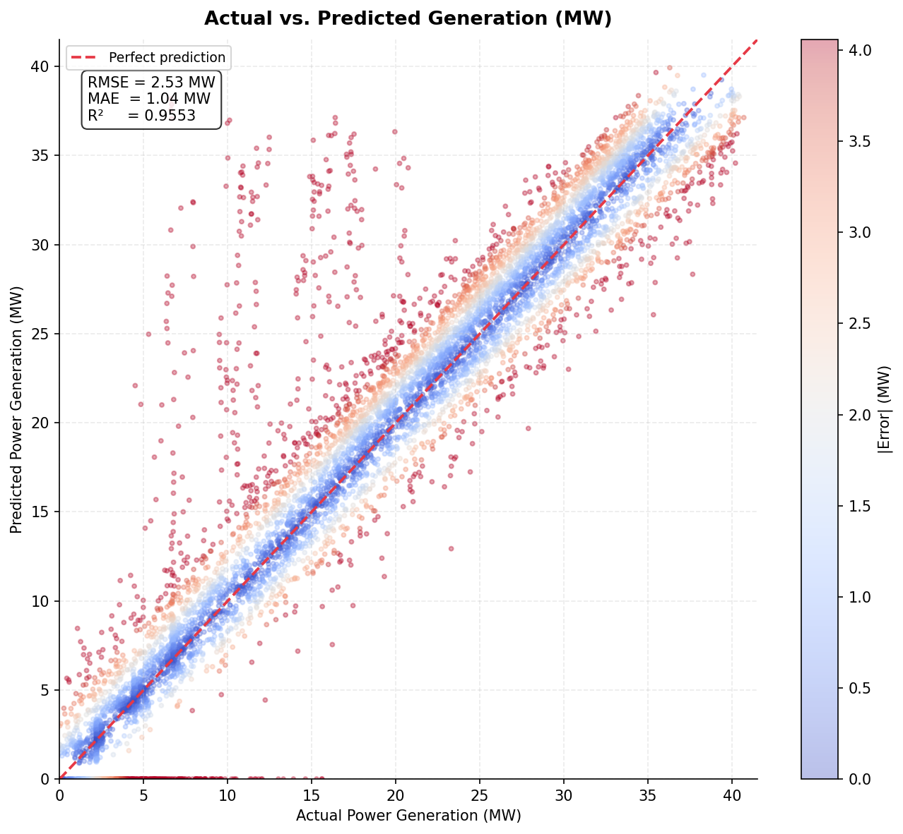
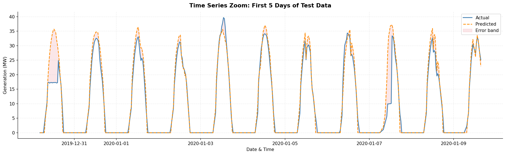
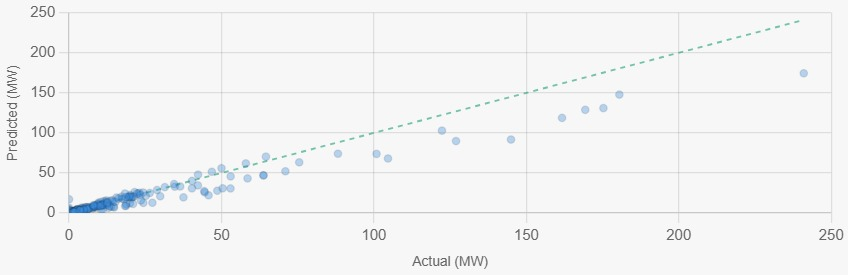
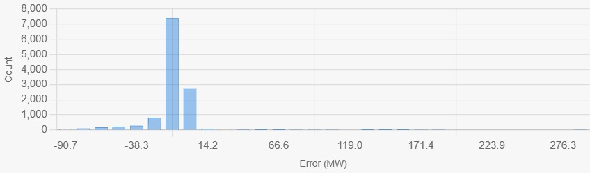

# 🌿 ECO POWER: Physics-Guided AI Forecasting
### *Precision Renewable Energy Diagnostics & Grid Intelligence*

ECO POWER is a state-of-the-art forecasting and analysis platform designed for the modern renewable energy grid. By combining **LightGBM machine learning models** with **physics-based irradiance modeling**, it provides ultra-accurate 15-minute generation forecasts for Solar and Wind assets.

---

## 🚀 Key Features

### 1. 15-Minute Generation Audit
A deep-dive diagnostic table that cross-references real-time telemetry with AI baselines.
- **Root Cause Analysis (RCA)**: Automatically identifies drivers like "Heavy cloud cover" or "Low wind cut-in" for every variance.
- **Weather Snapshots**: Integrated GHI, Wind Speed, Humidity, and Pressure data for every 15-minute block.

### 2. Physics-Informed AI
Unlike standard "black-box" models, ECO POWER uses a hybrid approach:
- **Solar**: Incorporates Solar Zenith Angle (SZA) and Plane of Array (POA) irradiance physics.
- **Wind**: Uses power-law profile adjustments for hub-height wind speed correction.

### 3. Interactive Asset Dashboard
A premium, glassmorphic UI built with **React** and **Tailwind CSS**.
- **Real-time Synchronization**: Polls backend every 30s for the latest grid status.
- **Visual Analytics**: Dynamic charts showing the delta between Predicted vs. Actual generation.

---

## 🏗️ Architecture & Code Quality

This project is engineered for maintainability and scalability, following industry-standard design patterns:

- **Modular Separation of Concerns**: 
  - `src/features`: Pure-physics transformations decoupled from ML logic.
  - `src/models`: Unified inference interface supporting multiple model versions.
  - `src/jobs`: Background synchronization decoupled from API request/response cycles.
- **Type Safety**: Fully typed TypeScript frontend and type-hinted Python backend to minimize runtime exceptions.
- **Resilient Data Pipelines**: Implements auto-interpolation for missing NWP weather blocks and robust error handling for API timeouts.
- **Low-Latency Reactivity**: Uses custom hooks and optimized state management to ensure the dashboard feels snappy even with large datasets.

---

## 🤖 Model Training & Validation

Our forecasting engine is powered by specialized LightGBM regressors trained on multi-year historical data.

### ☀️ Solar Model Performance
The solar model achieves an **R² of 0.955**, demonstrating exceptional tracking of the diurnal cycle and clear-sky indices.

| Actual vs. Predicted (MW) | Time Series Zoom (5 Days) |
| :---: | :---: |
|  |  |
| *High correlation with low residual variance.* | *Accurate tracking of ramp-up and ramp-down.* |

### 💨 Wind Model Performance
The wind model utilizes hub-height correction and U/V vector decomposition to handle complex wind patterns.

| Actual vs. Predicted (MW) | Error Distribution (MW) |
| :---: | :---: |
|  |  |
| *Consistent performance across speed ranges.* | *Low mean absolute error (MAE).* |
 R^2 is around 91.9% for wind
---

## ⚠️ Known Limitations & Challenges

While robust, ECO POWER is a living project with identified areas for professional evolution:

- **Database Concurrency**: The current SQLite implementation is excellent for development but lacks the row-level locking needed for high-frequency concurrent writes in a massive grid deployment. (Recommendation: Transition to PostgreSQL for Production).
- **Synthetic Actuals**: In the current version, "Actual" generation is derived from a high-fidelity physical simulator. In a live environment, this must be swapped for real-time SCADA Modbus/TCP integrations.
- **Stateless Scheduler**: The background jobs currently run within the same process as the API. For extreme reliability, these should be moved to a dedicated worker (e.g., Celery or Redis Queue).
- **Security**: The current dashboard is open. For enterprise use, an OAuth2/RBAC layer is required to protect sensitive grid telemetry.

---

## 🛠️ Technology Stack

| Component | Technology |
| :--- | :--- |
| **Frontend** | React 18, Vite, Tailwind CSS, Lucide Icons, Framer Motion |
| **Backend** | Python 3.10+, FastAPI, APScheduler |
| **AI/ML** | LightGBM, Scikit-Learn, Pandas, NumPy |
| **Physics** | PVLib (Solar position & Irradiance modeling) |
| **Database** | SQLAlchemy (SQLite for dev, Postgres compatible) |

---

## 📦 Getting Started

### 1. Clone & Setup
```bash
git clone https://github.com/your-repo/eco-power.git
cd eco-power
```

### 2. Backend Installation
```bash
cd backend
pip install -r requirements.txt
python -m src.api.main  # Runs on port 8080
```

### 3. Frontend Installation
```bash
cd frontend
npm install
npm run dev             # Runs on port 5173
```

---
*Built for the future of sustainable energy.* 🌍
