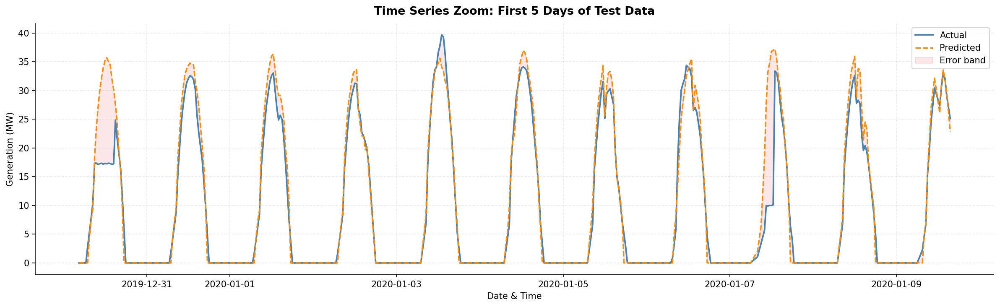

# 🌿 ECO POWER: Physics-Guided AI Forecasting
### *Precision Renewable Energy Diagnostics & Grid Intelligence*

ECO POWER is a state-of-the-art forecasting and analysis platform designed for the modern renewable energy grid. By combining **LightGBM machine learning models** with **physics-based irradiance modeling**, it provides ultra-accurate 15-minute generation forecasts for Solar and Wind assets.

---

## 🚀 Key Features

### 1. 15-Minute Generation Audit
A deep-dive diagnostic table that cross-references real-time telemetry with AI baselines.
- **Root Cause Analysis (RCA)**: Automatically identifies drivers like "Heavy cloud cover" or "Low wind cut-in" for every variance.
- **Weather Snapshots**: Integrated GHI, Wind Speed, Humidity, and Pressure data for every 15-minute block.

### 2. Physics-Informed AI
Unlike standard "black-box" models, ECO POWER uses a hybrid approach:
- **Solar**: Incorporates Solar Zenith Angle (SZA) and Plane of Array (POA) irradiance physics.
- **Wind**: Uses power-law profile adjustments for hub-height wind speed correction.

### 3. Interactive Asset Dashboard
A premium, glassmorphic UI built with **React** and **Tailwind CSS**.
- **Real-time Synchronization**: Polls backend every 30s for the latest grid status.
- **Visual Analytics**: Dynamic charts showing the delta between Predicted vs. Actual generation.

---

## 🏗️ Architecture & Code Quality

This project is engineered for maintainability and scalability, following industry-standard design patterns:

- **Modular Separation of Concerns**: 
  - `src/features`: Pure-physics transformations decoupled from ML logic.
  - `src/models`: Unified inference interface supporting multiple model versions.
  - `src/jobs`: Background synchronization decoupled from API request/response cycles.
- **Type Safety**: Fully typed TypeScript frontend and type-hinted Python backend to minimize runtime exceptions.
- **Resilient Data Pipelines**: Implements auto-interpolation for missing NWP weather blocks and robust error handling for API timeouts.
- **Low-Latency Reactivity**: Uses custom hooks and optimized state management to ensure the dashboard feels snappy even with large datasets.

---

## 🤖 Model Training & Validation

Our forecasting engine uses separate LightGBM models for solar and wind, trained on
Plant-Load-Factor (PLF) targets with physics-informed features.

> ⚠️ **Note on data**: models are currently trained on physics-simulated /
> "realistic" generation data, not measured SCADA. Reported metrics reflect
> performance against that data. See *Known Limitations* below.

### ☀️ Solar Model
A physics-guided LightGBM regressor (**910 trees, 41 features** — SZA, tilted POA
irradiance, clear-sky/clearness indices, cloud layers, GHI lags & rolling stats).
It produces a single point forecast (no quantile band) and is scaled per-plant from
a reference-capacity baseline.

| Actual vs. Predicted (MW) | Time Series Zoom (5 Days) |
| :---: | :---: |
|  |  |

### 💨 Wind Model
LightGBM **quantile** regression (P10 / P50 / P90) on Plant-Load-Factor. The
operative wind is the **hub-height wind**, derived per-record from the 80 m and
120 m NWP wind speeds via a power-law profile (`V_hub = V_120·(hub/120)^α`,
α = ln(V₁₂₀/V₈₀)/ln(120/80)) — the raw 10 m wind is deliberately **not** used, so
training and live inference operate on the same physical quantity. Features also
include U/V wind-vector decomposition, temporal, lag and rolling terms.

- In-sample CV-RMSE (PLF): **P50 ≈ 0.034**, P10 ≈ 0.042, P90 ≈ 0.044
  (see `models/saved/wind_metrics.json`).
- **Cross-year holdout** (trained on 2022, tested on unseen 2024 data):
  RMSE ≈ 0.077, correlation **r ≈ 0.96**, near-unbiased (bias ≈ −0.02).

The live dashboard displays the P50 median.

| Actual vs. Predicted (MW) | Error Distribution (MW) |
| :---: | :---: |
|  |  |

---

## ⚠️ Known Limitations & Challenges

While robust, ECO POWER is a living project with identified areas for professional evolution:

- **Database Concurrency**: The current SQLite implementation is excellent for development but lacks the row-level locking needed for high-frequency concurrent writes in a massive grid deployment. (Recommendation: Transition to PostgreSQL for Production).
- **Synthetic Actuals**: In the current version, "Actual" generation is derived from a high-fidelity physical simulator. In a live environment, this must be swapped for real-time SCADA Modbus/TCP integrations.
- **Stateless Scheduler**: The background jobs currently run within the same process as the API. For extreme reliability, these should be moved to a dedicated worker (e.g., Celery or Redis Queue).
- **Security**: The current dashboard is open. For enterprise use, an OAuth2/RBAC layer is required to protect sensitive grid telemetry.

---

## 🛠️ Technology Stack

| Component | Technology |
| :--- | :--- |
| **Frontend** | React 18, Vite, Tailwind CSS, Lucide Icons, Framer Motion |
| **Backend** | Python 3.10+, FastAPI, APScheduler |
| **AI/ML** | LightGBM, Scikit-Learn, Pandas, NumPy |
| **Physics** | PVLib (Solar position & Irradiance modeling) |
| **Database** | SQLAlchemy (SQLite for dev, Postgres compatible) |

---

## 📦 Getting Started

### 1. Clone & Setup
```bash
git clone https://github.com/your-repo/eco-power.git
cd eco-power
```

### 2. Backend Installation
```bash
cd backend
pip install -r requirements.txt
python main.py            # Unified server on port 8000
```

### 3. Frontend Installation
```bash
cd frontend
npm install
npm run dev             # Runs on port 5173
```

---
*Built for the future of sustainable energy.* 🌍
